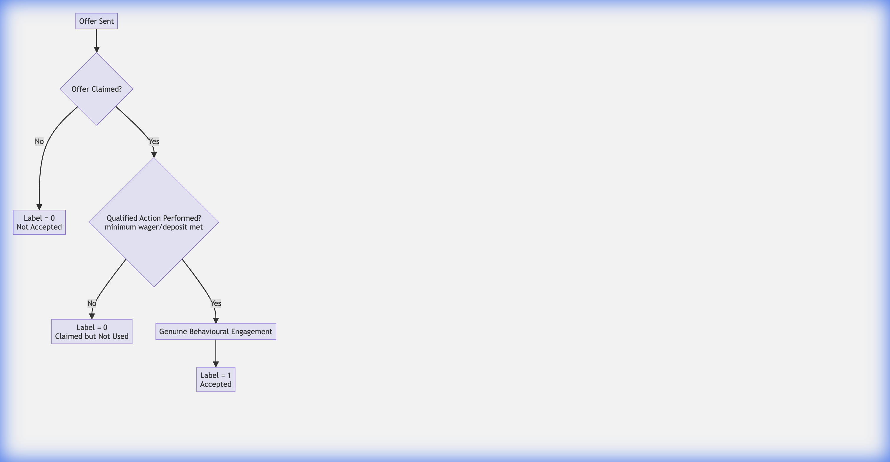

# AI Features

**Last updated:** 2025-12-09

Visionary Space CRM integrates AI to move beyond simple data storage to active strategic advisory.

## 1. AI Advisor (Chat)
A RAG-lite (Retrieval Augmented Generation) interface accessible via the sidebar.

### Capabilities
- **Data Analysis:** "How many leads did we generate in the UK last month?"
- **Recommendations:** "Suggest 3 marketing strategies for the 'Summer Sale' campaign."
- **Drafting:** "Write a polite email to the 'TechNova' client regarding the delay."

### Technical Implementation
- **Frontend:** Sends user query + relevant snippets of the current view's state (Json).
- **Backend:** Forwards prompt to Google Gemini Pro via the Google Generative AI SDK.
- **Privacy:** State data is stripped of PII (Personally Identifiable Information) before prompt injection where possible.

## 2. Infographics Generator
*Feature Flag:* `feature_infographics`

Automatically converts complex datasets into visual diagrams using Mermaid.js syntax.
1.  **Input:** User selects a dataset (e.g., "Campaign ROI" or "Project Timeline").
2.  **Processing:** AI Model generates a valid Mermaid script.
3.  **Output:** Frontend renders the script into a downloadable chart/diagram.

## 3. Predictive Analytics (Beta)
*Feature Flag:* `ff_beta_dashboard`

The Beta Dashboard uses simple regression models (Python/NumPy in backend) to forecast:
- **Project Completion Risk:** Based on task velocity.
- **Budget Burn Rate:** Predicting if a campaign will overspend.

## 4. Heuristic Label Construction Pipeline

This flowchart illustrates the logic used to determine the acceptance label for offers, ensuring that only genuine engagement results in a positive label.



<details>
<summary>Mermaid Source Code</summary>

```mermaid
graph TD
    Start[Offer Sent] --> Q1{Offer Claimed?}
    Q1 -- No --> L0_NA[Label = 0<br>(Not Accepted)]
    Q1 -- Yes --> Q2{Qualified Action Performed?<br>(minimum wager/deposit met)}
    Q2 -- No --> L0_CNU[Label = 0<br>(Claimed but Not Used)]
    Q2 -- Yes --> GBE[Genuine Behavioural Engagement]
    GBE --> L1[Label = 1<br>(Accepted)]
```
</details>
