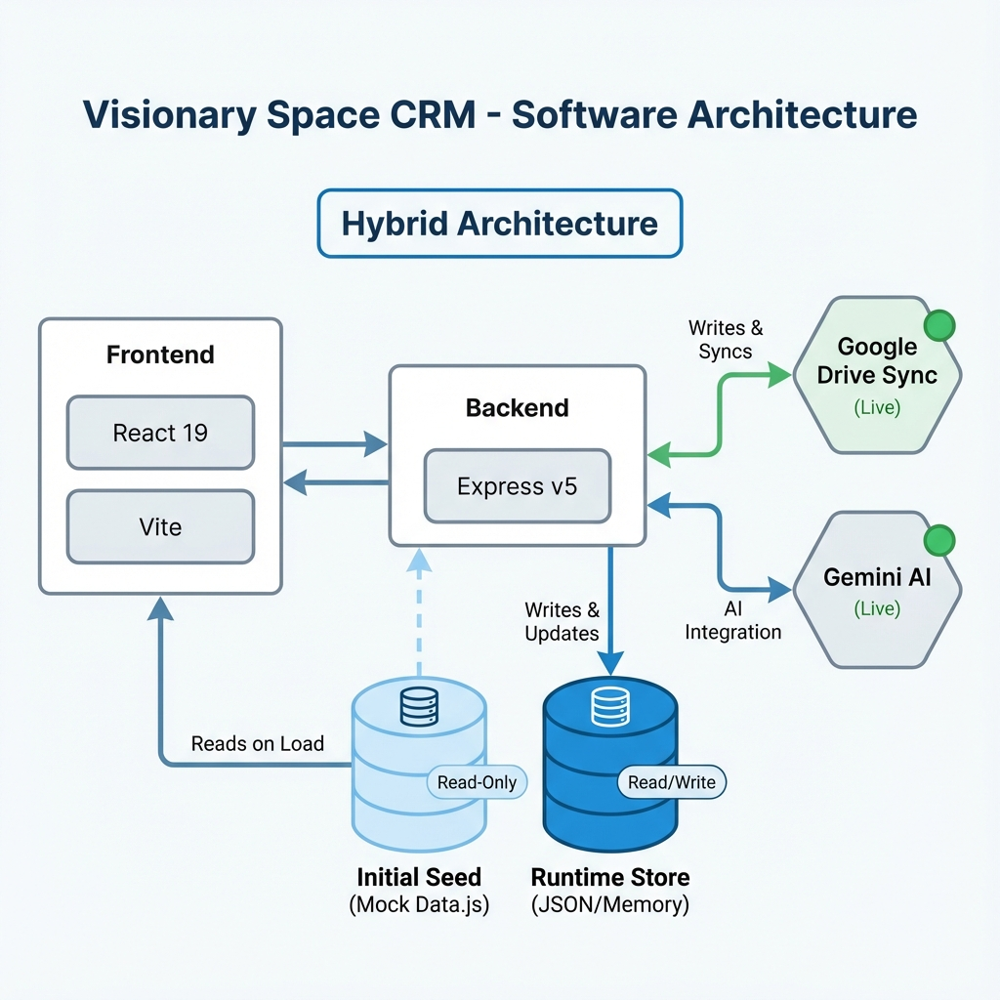
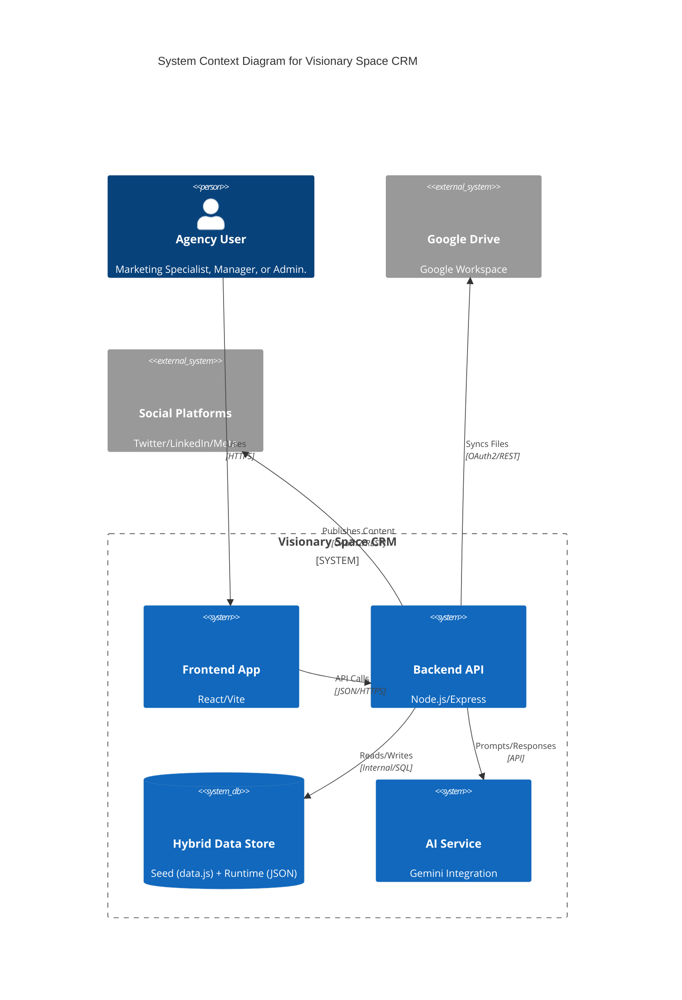

# System Architecture

**Last updated:** 2025-12-09

## High-Level Overview

Visionary Space CRM follows a client-server architecture. The frontend is a rich, interactive Single Page Application (SPA) that communicates with a Node.js backend. The system is designed to be modular, with distinct services for data management, file storage, and AI processing.

## Core Components

### 1. Frontend (Client)
- **Build Tool:** Vite (v6.2.0).
- **Framework:** React (v19.2.0) with TypeScript (v5.8.2).
- **Styling:** Tailwind CSS (via `tailwind-merge` & `clsx`).
- **Visualization:** Recharts (v3.5.1).
- **State Management:** React Context API + Hooks.
- **Diagrams:** Mermaid.js (v11.12.2) & `html-to-image` for exports.

### 2. Backend (Server)
- **Runtime:** Node.js (v18+).
- **Framework:** Express.js (v5.1.0).
- **Data Persistence Layer (Hybrid):**
  - **Seed:** `data.js` provides rich, static initial data for development bootstrapping.
  - **Runtime:** In-memory/JSON storage allows for interactive CRUD operations during the session.
  - **Live:** Uploads and Google integrations interact with real external systems.
- **File Handling:** Multer (v2.0.2).
- **Google Integration:** `googleapis` SDK (v166.0.0) for Drive Sync.
- **AI Integration:** `@google/genai` (v1.30.0).

### 3. AI Engine
- **Provider:** Google Gemini.
- **Function:**
  - **Advisor:** RAG-lite implementation where system data is injected into the context window to answer questions like "How is my Q4 campaign performing?".
  - **Infographics:** Generates structural data (Mermaid syntax/JSON) that the frontend renders as diagrams.

### 4. Integrations
- **Google Drive:** Two-way sync for project documentation.
- **Feature Flags:** A built-in toggle system to enable/disable modules (Beta Dashboard, Dark Mode) dynamically per country or user.
